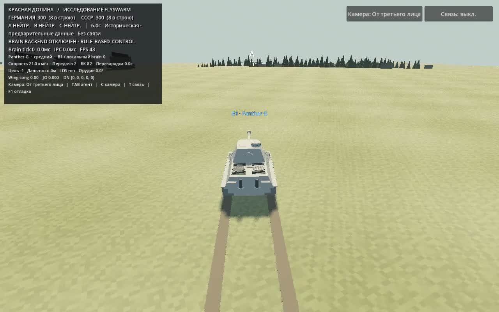

# FlySwarm — коннектом в танковой среде

Исследовательская симуляция боя **8 × 8**: Godot моделирует мир и технику,
а Python связывает наблюдения агентов с реконструированным коннектомом
**Drosophila MaleCNS**. Можно наблюдать автономный бой, управлять танком
на полигоне и сравнивать условия эксперимента.

## Скринкаст интерфейса

[](docs/media/interface-demo.mp4)

**[Смотреть / скачать MP4](docs/media/interface-demo.mp4)** · 35 секунд ·
1280 × 800 · без звука. Запись реального интерфейса: главное меню, настройка
боя, камеры, пауза, ручной полигон, исследовательская лаборатория, обучение,
настройки и повторы. В записи используется Rule AI; она не изображает
запуск нейробэкенда. Переходы автоматизированы для воспроизводимой записи.
GitHub может предложить скачать MP4 вместо встроенного воспроизведения.

## Что работает

| Возможность | Описание |
|---|---|
| Исторический бой | 16 машин, две команды, точки A/B/C, билеты и итоговая статистика |
| Контроллеры | Rule AI, MaleCNS, фиксированный обученный моторный адаптер для каждой команды |
| Камеры | Обзор поля боя, от третьего лица, прицел и свободная камера |
| Ручной полигон | Выбор машины и цели, дистанции 100–1500 м, углы цели, движение и стрельба |
| Физика | Движение, конечная скорость снаряда, приближённая броня и повреждения модулей |
| Гусеницы | Видимые следы с приближённым влиянием давления, поверхности и проскальзывания |
| Нейронная связь | No Audio / Team Audio / All Audio; панель сигналов и линии между агентами |
| Research Lab | Сравнение условий связи, физики, смены сторон и переноса политик; отмена задания |
| Обучение | Сбор примеров, ridge-адаптер, сохранение и проверка на отдельном seed |
| Повторы | Запись состояний мира и телеметрии, воспроизведение без MaleCNS |
| MARL API | PettingZoo ParallelEnv для 16 агентов, random baseline и общий PPO/IPPO readout |
| Интерфейс | RU/EN, сохранение языка и настроек, пауза, возврат в меню, управление бэкендом |

Техника: **Panther G, Tiger I, Jagdpanther, T-34-85, IS-2, SU-100, Tiger**.


## Быстрый старт

Проверенная платформа: macOS Apple Silicon. Нужен Godot 4.7.2, установленный
в `~/Applications/Godot.app` либо `/Applications/Godot.app`.

```sh
./run.sh
```

Откроется главное меню. Rule AI и полигон доступны без загрузки MaleCNS.
Путь к другому Godot можно передать через `GODOT` — см. `run.sh`.

Для нейронного режима дополнительно подготовьте Python 3.11:

```sh
python3.11 -m venv .venv
.venv/bin/python -m pip install -r requirements.txt
```

MaleCNS dataset устанавливается отдельно в расположение, ожидаемое FlyBrain
(в проверенном окружении `/Users/serg/fly-data`). Dataset и `.venv` не входят
в Git. При отсутствии зависимостей приложение предлагает повторить запуск
или выбрать Rule AI. [Подробности запуска](docs/application.md).

## Управление

| Клавиша | Действие |
|---|---|
| `C` / кнопка камеры | Переключить камеру |
| Колесо, `WASD` в обзоре | Масштаб и перемещение по карте |
| `Tab` | Следующий агент |
| `T` / кнопка связи | Выкл. → красные → синие → все |
| `Esc` | Пауза / меню |
| `W/S`, `A/D` на полигоне | Движение и поворот |
| `Q/E`, `R/F` | Башня и вертикальная наводка |
| Пробел / ЛКМ, движение с ПКМ | Выстрел, наведение |
| `F1` | Отладочный вид |

## Как устроен эксперимент

```text
Godot: мир → признаки наблюдения
                 ↓
Python: сенсорный кодировщик → два отдельных FlyBrain(batch=8)
                 ↓
нисходящие нейроны → моторный readout → действия в Godot
```

Каждая команда получает отдельный объект MaleCNS; это **2 × batch 8**,
а не один batch 16. В проверенном dataset — 2 667 200 нейронных состояний.
Коннектом фиксирован. Обучение меняет небольшой моторный readout, а не
связи MaleCNS. Нейронный сигнал крыльев предыдущего шага поступает через
среду к JO-A/JO-B; панель показывает численные вклады, не расшифрованную речь.

Это исследовательская модель, не доказательство биологического поведения.
Сенсорный ввод использует признаки вместо изображения сетчатки; ряд функций,
включая базовую стрельбу, задаётся правилами. Исторические размеры, броня и
физика содержат приближения. Полная историческая валидация моделей не пройдена.
Недоступные учебные задачи отключены; награда для ridge imitation не определена.
Звуковое сопровождение и готовое подписанное macOS-приложение не реализованы.

## Проверки и воспроизводимость

```sh
./tools/run run-tests
./run.sh --headless --script res://scripts/app/validation.gd
# Только при установленном реальном dataset:
./run.sh --headless --script res://scripts/app/validation.gd -- --real-brains
```

Seed, параметры сессии, метрики и повторы сохраняются в `results/raw/app/`
при запуске из исходников. Каждая записанная сессия создаёт ограниченные
`results.csv`, `per_agent.csv`, `actions.csv` и `summary.json`; action export
разделяет нейронный trace, decoder, objective/gunnery auxiliary, adapter и
финальное действие. Raw-вывод исключён из Git. Старые исследовательские
файлы сохранены; [журнал экспериментов](docs/experiment_log.md) и
[исторический контекст](docs/research_background.md).

## Структура проекта

```text
frontend/godot/   приложение, сцены, интерфейс, 3D-модели
src/flyswarm/     Python-бэкенд, сенсорика, readout, IPC
assets/models/   исходные Blender-модели
experiments/     исторические исследовательские эксперименты
archive/         сохранённые прототипы
data/            параметры техники, вооружения и сценариев
tests/           быстрые проверки без загрузки dataset
tools/           запуск, генерация моделей, проверки
docs/media/      скринкаст и его обложка
docs/            исследования, источники, валидация
```

[Архитектура приложения](docs/application.md) ·
[PettingZoo и MARL](docs/marl.md) ·
[Приближения](docs/known_approximations.md) ·
[Источники моделей](docs/references/pass03_audit.md) ·
[Подготовка macOS-сборки](docs/macos_packaging.md)
